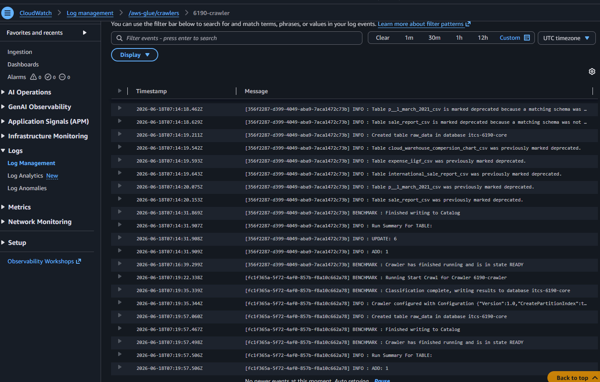
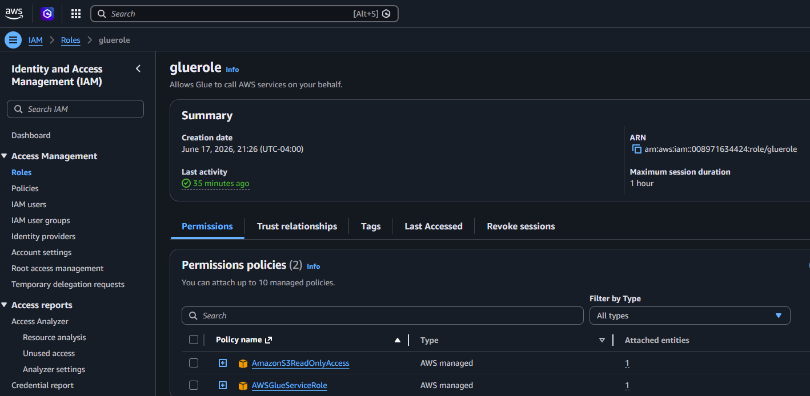
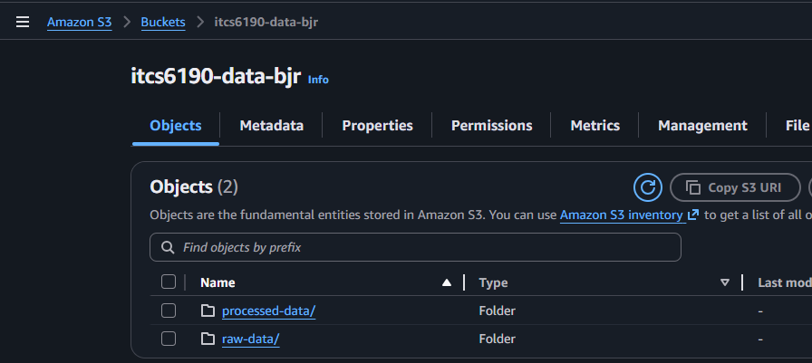

> **Note:** Please refer to the initial project requirements in the [itcs6190_aws_core_services.pdf](https://github.com/ITCS6190-Summer2026/Hands-on-AWS-Core-Services/blob/main/itcs6190_aws_core_services.pdf) file before proceeding with the configurations below.

## AWS Core Services Assignment Guide

### 1. S3 Bucket Setup & Structure
* **Global Uniqueness:** S3 bucket names must be globally unique across all AWS accounts. Append a unique identifier, such as your student ID or initials (e.g., `itcs6190-raw-data-[yourinitials]`).
* **Recommended Structure:** Create either two separate buckets or one main bucket with two folders:
  * `raw-data/` -> Upload your downloaded Kaggle CSV here.
  * `processed-data/` -> Designate this for Athena query results.

### 2. IAM Role Configuration
To give your Glue Crawler permission to access your data, create an IAM Role with the following parameters:
* **Trusted Entity Type:** AWS Service
* **Service:** `Glue`
* **Permissions Policies to Attach:**
  * `AWSGlueServiceRole` (Provides basic crawler permissions)
  * `AmazonS3ReadOnlyAccess` (Allows the crawler to read data from your S3 bucket)

### 3. Glue Crawler Navigation (AWS Console)
Because the AWS Console UI updates frequently, use the search bar at the top of the AWS Console to find **AWS Glue**:
1. In the left sidebar, click on **Crawlers** under the *Data Catalog* section.
2. Click **Create crawler**.
3. Name your crawler and specify the S3 path to your `raw-data/` folder as the data store.
4. Assign the IAM role created in the previous step.
5. Configure the output to point to a database (create a new database if you don't have one yet).

## Approach & Explanation

This assignment demonstrates a serverless data pipeline on AWS using S3, Glue, CloudWatch, and Athena — no servers to provision or manage.

**Dataset:** The `Amazon Sale Report.csv` from the Kaggle e-commerce dataset was used. It contains order-level records with fields for product category, fulfilment method, order status, SKU, quantity, amount, and date — all columns required by the 5 queries.

**Pipeline Overview:**
1. **S3** stores the raw CSV in `raw-data/` and Athena query results in `processed-data/`.
2. **IAM Role** grants the Glue Crawler read access to S3 and permission to write metadata to the Glue Data Catalog.
3. **Glue Crawler** scans the S3 folder, infers the CSV schema, and registers the table in the Data Catalog automatically — no manual `CREATE TABLE` needed.
4. **CloudWatch** logs the crawler run so you can verify it completed successfully and see how many records were detected.
5. **Athena** queries the catalogued table directly against the CSV in S3 using standard SQL.

**Key decisions:**
- Only `Amazon Sale Report.csv` was loaded — the other 6 Kaggle files contain financial summaries and unrelated data that would create schema conflicts if placed in the same S3 prefix.
- Each CSV was placed in its own subfolder so the Glue Crawler maps one folder -> one table cleanly.
- Query 4 uses `SUBSTR(date, 7, 2) || '-' || SUBSTR(date, 1, 2)` to extract a sortable `YY-MM` string from the `MM-DD-YY` date format in the source data.

## Screenshots

### CloudWatch — Crawler Run Log



### IAM Role — Permissions



### S3 Buckets — Structure



## Results

### Query 1 Basic Table Exploration

```
SELECT * FROM "itcs-6190-core"."raw_data" limit 10;
```

Results can be found here: [QueryResults\Query1.csv](QueryResults\Query1.csv)

### Query 2 Orders by Product Category
```
-- Query 2 — Orders by Product Category: Write a query that returns count of each product category along with the total number of orders placed in that category.
SELECT category, COUNT(*) AS total_orders
FROM "itcs-6190-core"."raw_data"
GROUP BY category
ORDER BY total_orders DESC
LIMIT 10;
```

Results can be found here: [QueryResults\Query2.csv](QueryResults\Query2.csv)


### Query 3 Revenue and Quantity by Fulfilment Method
```
-- Query 3 — Revenue and Quantity by Fulfilment Method: Write a query that returns eachfulfilment method with its total number of orders, total units sold, and total revenue — excluding cancelled and pending orders — sorted by highest revenue first.
SELECT 
    fulfilment,
    COUNT(*) AS total_orders,
    SUM(qty) AS total_units_sold,
    SUM(amount) AS total_revenue
FROM "itcs-6190-core"."raw_data"
WHERE LOWER(status) NOT IN ('cancelled', 'pending')
GROUP BY fulfilment
ORDER BY total_revenue DESC
LIMIT 10;
```

Results can be found here: [QueryResults\Query3.csv](QueryResults\Query3.csv)


### Query 4 Monthly Sales Trend
```
-- Query 4 — Monthly Sales Trend: Write a query that returns each month along with the total number of orders and total revenue generated in that month, excluding canceled and pending orders, sorted chronologically from earliest to latest.
SELECT 
    SUBSTR(date, 7, 2) || '-' || SUBSTR(date, 1, 2) AS month,
    COUNT(*) AS total_orders,
    SUM(amount) AS total_revenue
FROM "itcs-6190-core"."raw_data"
WHERE LOWER(status) NOT IN ('cancelled', 'pending')
GROUP BY SUBSTR(date, 7, 2) || '-' || SUBSTR(date, 1, 2)
ORDER BY month ASC
LIMIT 10;
```

Results can be found here: [QueryResults\Query4.csv](QueryResults\Query4.csv)


### Query 5 Top 5 Best-Selling SKUs per Category
```
-- Query 5 — Top 5 Best-Selling SKUs per Category: Write a query that returns the top 5 SKUs in each product category ranked by total revenue, showing the category, SKU, total revenue, total units sold, and rank — excluding canceled, pending, and zero-quantity orders.
SELECT category, sku, total_revenue, total_units_sold, rnk
FROM (
    SELECT 
        category,
        sku,
        SUM(amount) AS total_revenue,
        SUM(qty) AS total_units_sold,
        RANK() OVER (PARTITION BY category ORDER BY SUM(amount) DESC) AS rnk
    FROM "itcs-6190-core"."raw_data"
    WHERE LOWER(status) NOT IN ('cancelled', 'pending')
      AND qty > 0
    GROUP BY category, sku
) ranked
WHERE rnk <= 5
ORDER BY category, rnk
LIMIT 10;
```

Results can be found here: [QueryResults\Query5.csv](QueryResults\Query5.csv)
